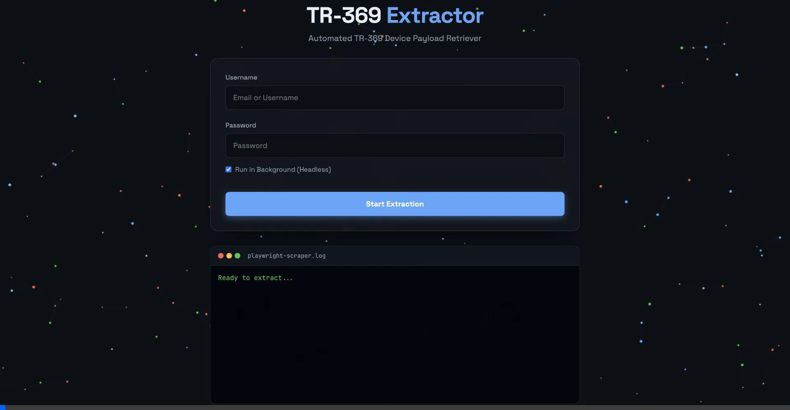

Oktopus TR-369 Payload Extractor



Welcome to the Oktopus TR-369 Payload Extractor. We built this tool because manually clicking through the Oktopus management platform to gather device parameter data takes a huge amount of time. This application acts like an automated assistant that opens a browser for you, carefully navigates through all those deeply nested folders, and patiently extracts every single piece of information it can find.

When you run it, you will be greeted by a clean interface featuring an interactive particle background. It is designed to look very modern while doing all the heavy lifting behind the scenes so that you do not have to.

Let me explain the two different ways you can get this application running on your system.

The first method is using Docker Compose, which is the absolute easiest and our most recommended path. Using Docker means you do not have to worry about downloading local dependencies or installing browser binaries directly onto your computer. You can directly locate the official Docker Hub public repository at https://hub.docker.com/r/hacksmith/tr369-fetcher if you need to manually inspect or pull the image structure.

The only things you require are Docker Engine and Docker Compose. Once you have those installed, simply open your favorite text editor, create a blank file named docker-compose.yml anywhere on your computer, and paste the following block of code into it.

```yaml
version: '3.8'

services:
  tr369-fetcher:
    image: hacksmith/tr369-fetcher:latest
    container_name: tr369-fetcher-gui
    ports:
      - "3000:3000"
    restart: unless-stopped
    shm_size: '1gb'
```

After saving that file, open your terminal in that exact same directory and type docker-compose up -d to spin everything up in the background. Finally, open your web browser and navigate to http://localhost:3000 to start using the dashboard interface.

The second installation method is for developers who prefer working natively in their local environment using NPM.

For this local route, you require Node.js version 18 or higher as well as the Node Package Manager installed on your system.

To begin, you will need to clone the project repository down to your machine and install the required utility packages. You can accomplish this by running these commands in your terminal.

```bash
git clone https://github.com/abhigyan17/JioAirfiber_Unlock.git
cd JioAirfiber_Unlock/TR369_Extractor
npm install
```

Because our scraping engine relies on a library called Playwright to actually control the browser, you must download the correct Chromium browser binaries for it to use. You can do this by entering the following command.

```bash
npx playwright install --with-deps chromium
```

Once the downloads are complete and everything is ready, you can start the local server. The program will automatically bind the network port and attempt to open a new tab directly in your default web browser pointing to http://localhost:3000.

```bash
npm start
```

Using the application is incredibly straightforward once the webpage finishes loading.

First, type your usual Oktopus login credentials directly into the text fields on the interface.
Second, click the Start Extraction button to let the automated engine begin its journey.
Third, you can sit back and watch the live terminal display on the screen as the engine explores the target parameters in real time.
Fourth, when the extraction process concludes, click the Download JSON button to safely capture all of your gathered data into a single flat file.

We strongly encourage everyone in the community to get involved and contribute to this evolving project. We are actively looking to expand this tool far beyond simple parameter extraction. If you are interested in collaborating, please consider submitting code to add powerful new functionalities like executing custom Remote Procedure Call commands, automating firmware update deployments, or integrating dynamic push capabilities to directly manipulate the device objects. Whether you want to squash existing bugs or engineer these advanced new features, your assistance is deeply valued. Please take a moment to open an issue or submit your pull request on the repository page so we can enhance the overall capabilities of this tool together.
